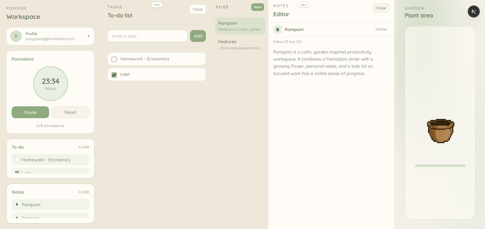

# Pompom

Pompom is a calm, garden-inspired productivity workspace. It combines a Pomodoro timer with a growing flower, personal notes, and a task list so focused work has a visible sense of progress.

## Application Preview

The application workspace:



## Flower Growth Stages

Each completed focus session helps the hand-drawn pomodoro flower grow through these stages:

<p align="center">
   
   
   
   
   
   
   
</p>

## Features

- Email and password authentication with Supabase
- Pomodoro focus timer with short and long breaks
- Flower growth progress linked to completed focus sessions
- Personal notes stored per user
- Task list with completion tracking
- Account sign-out and account deletion
- Row Level Security policies for user-owned data

## Tech Stack

- [Next.js](https://nextjs.org/) 16 with the App Router
- React 19 and TypeScript
- [Supabase](https://supabase.com/) for authentication and PostgreSQL data
- Tailwind CSS 4

## Requirements

- Node.js 20 or newer
- A Supabase project

## Local Setup

1. Install dependencies:

   ```bash
   npm install
   ```

2. Create a `.env.local` file in the project root:

   ```env
   NEXT_PUBLIC_SUPABASE_URL=https://your-project.supabase.co
   NEXT_PUBLIC_SUPABASE_ANON_KEY=your-anon-key
   SUPABASE_SERVICE_ROLE_KEY=your-service-role-key
   ```

   `SUPABASE_SERVICE_ROLE_KEY` is used only by the server-side account deletion endpoint. Never expose it to the browser or commit it to source control.

3. In the Supabase SQL Editor, run the scripts in this order:
   - `supabase/notes_tasks.sql`
   - `supabase/plants.sql`

   These scripts create the application tables and enable Row Level Security so users can access only their own records.

4. Start the development server:

   ```bash
   npm run dev
   ```

5. Open [http://localhost:3000](http://localhost:3000).

## Available Scripts

```bash
npm run dev      # Start the development server
npm run build    # Create a production build
npm run start    # Start the production server
npm run lint     # Run ESLint
```

## Project Structure

```text
src/
  app/              Next.js routes, layouts, login, and API endpoints
  components/       Workspace UI and productivity components
  context/          Client state for flowers, notes, panels, and tasks
  lib/supabase/     Browser/server Supabase clients and data helpers
  types/            Shared TypeScript types
public/flowers/     Flower growth-stage images
supabase/            Database schema and Row Level Security policies
```

## Deployment

The app can be deployed to Vercel or another Next.js-compatible hosting provider. Configure the same environment variables from `.env.local` in the hosting provider's project settings, then deploy with:

```bash
npm run build
npm run start
```
